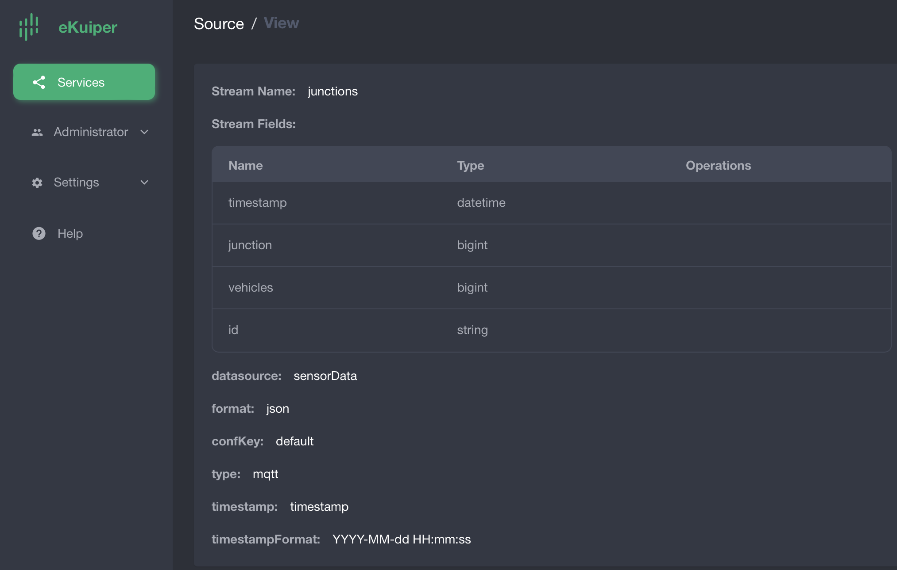
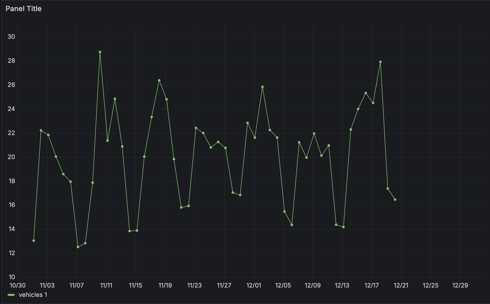
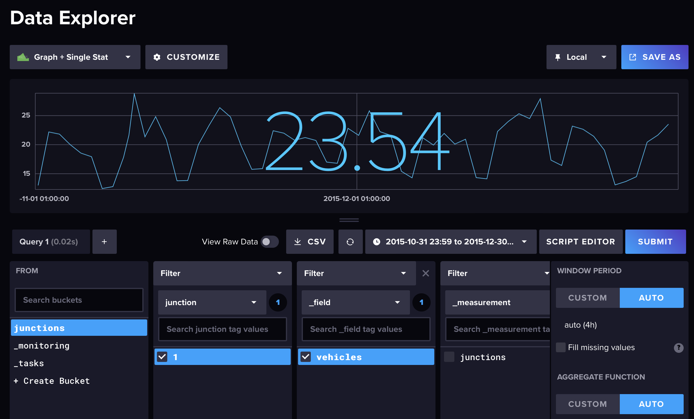
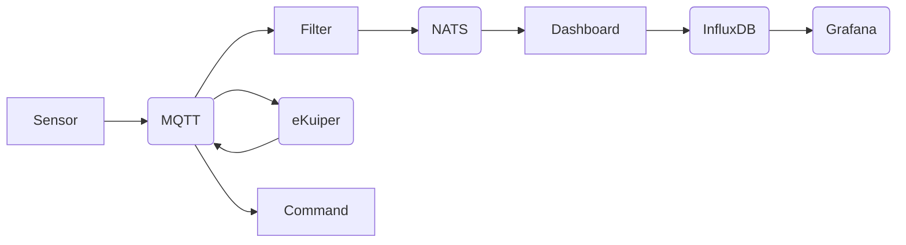

# Internet stvari i servisa - 3. projekat

Projekat realizovan za potrebe predmeta Internet stvari i servisi na 4. godini smera RII na Elektronskom fakultetu u Nišu.


## Kontejneri

- NATS
- eKuiper
- eKuiper manager
- mosquitto
- grafana
- command
- sensor
- filter
- dashboard
- influxDB

## NATS


```yaml
nats:
	image: nats
	container_name: nats
	ports:
		- "4222:4222"
		- "6222:6222"
		- "8222:8222"
	networks:
		- net1
```
Koristi se NuGet package NATS.Client, filter servis šalje average podatke NATS serveru, dashboard čita podatke sa NATS servera i dalje ih obrađuje. Podaci u pitanju su prosečan broj vozila u toku 24h na jednoj raskrsnici.

## eKuiper

```yaml
ekuiper:
	image: lfedge/ekuiper:1.13.5
	ports:
		- "9081:9081"
		- "127.0.0.1:20498:20498"
	container_name: ekuiper
	hostname: ekuiper
	restart: unless-stopped
	networks:
		- net1
	user: root
	depends_on:
		- mosquitto
	volumes:
		- ./eKuiper/data:/kuiper/data
		- ./eKuiper/log:/kuiper/log
	environment:
		MQTT_SOURCE__DEFAULT__SERVER: "mosquitto:1883"
		KUIPER__BASIC__CONSOLELOG: "true"
		KUIPER__BASIC__IGNORECASE: "false"
```
Komande pokrenute na eKuiper-u:

- docker exec -it ekuiper /bin/sh
- bin/kuiper create stream demo '(timestamp datetime, junction bigint, vehicles bigint, id string) WITH (FORMAT="JSON", DATASOURCE="sensorData")'
- bin/kuiper query
- select * from demo where 
Preko eKuiper manager-a se podešava sink.

## eKuiper manager

```yaml
ekuiper-manager:
	image: emqx/ekuiper-manager:1.9.5-plus-ief
	container_name: ekuiper-manager
	networks:
		- net1
	ports:
		- "9082:9082"
	environment:
		DEFAULT_EKUIPER_ENDPOINT: "http://ekuiper:9081"
```


## mosquitto

```yaml
mosquitto:
	image: eclipse-mosquitto
	container_name: mosquitto
	ports:
		- "1883:1883"
	volumes:
		- ./Mosquitto/config:/mosquitto/config
		- ./Mosquitto/data:/mosquitto/data
		- ./Mosquitto/log:/mosquitto/log
	networks:
		- net1
	nats:
	image: nats
	container_name: nats
	ports:
		- "4222:4222"
		- "6222:6222"
		- "8222:8222"
```

Message broker za mqtt protokol startovan lokalno kao docker kontejner.

## grafana

```yaml
grafana:
	image: grafana/grafana
	container_name: grafana
	networks:
		- net1
	ports:
		- "3000:3000"
```


## Command

```yaml
command:
	image: command
	networks:
		- net1
	ports:
		- "5001:5001"
```

Plain html + js sa websocket vezom za prikaz podataka sa MQTT. Realizovan u Python Flask.

## Sensor

``` yaml
sensor:
	image: sensor
	container_name: sensor
	depends_on:
		- mosquitto
	networks:
		- net1
```
Realizovan u .NETCore, [podaci](https://www.kaggle.com/datasets/vetrirah/ml-iot).

## Filter

```yaml
filter:
	image: filter
	container_name: filter
	depends_on:
		- mosquitto
		- nats
		- sensor
	networks:
		- net1
```
Realizovan u .NETCore, prosleđuje prosečnu vrednost za 24h NATS serveru na topic "avg".

## Dashboard

```yaml
dashboard:
	image: dashboard
	environment:
		INFLUXDB_TOKEN: "_xYEHJjDbr-0CVqHRGlecu27IJMFPqPRT8SXmmVOPeNIN8O77-_2JF1Gc_QEX95wenh2JXkJcIxj4RY_sz9EgQ=="
	depends_on:
		- nats
	networks:
		- net1
```
CORS problem.

## InfluxDB

```yaml
influxdb:
	image: influxdb
	container_name: influxdb
	ports:
		- "8086:8086"
	volumes:
		- influxdb-data:/var/lib/influxdb2
	networks:
		- net1
```

## Docker-compose

Pokretanjem [docker compose-a](docker-compose.yml) u root folderu se pokreću svi servisi.

